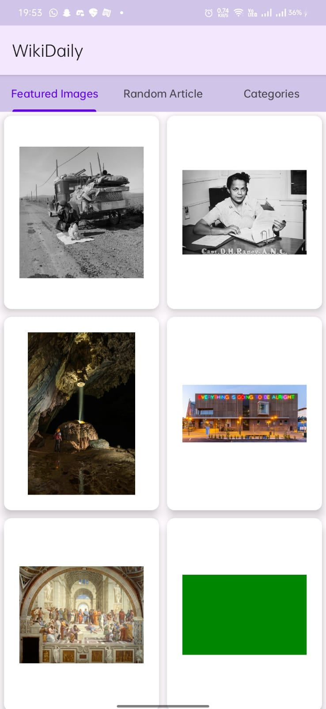

# WikiNews

**WikiNews** is an Android app developed in Kotlin using Android Studio. It integrates with the Wikipedia API to deliver dynamic content.

## Highlights

The landing screen features:
- **Random Articles**: Discover random articles from Wikipedia.
- **Featured Images**: View the day’s featured images.
- **Category List**: Explore Wikipedia’s categories in three distinct tabs, each with pagination for smooth browsing.

## Features
- **Catchup Mode**: Easily catch up on daily highlights.
- **MVVM Architecture**: Structured for maintainability and testability.
- **Coroutines**: For seamless asynchronous programming.
- **Material UI**: Styled with Google’s Material Design for a clean and modern interface.

## Libraries Used
- **Retrofit**: For network requests.
  - **Gson Converter**: JSON parsing.
  - **Scalar Converter**: Simple string response parsing.
- **Glide**: Image loading and caching.

## Screenshots

  
  

